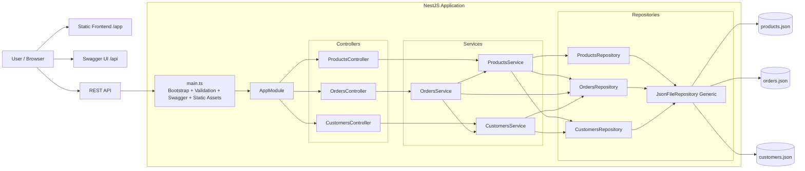
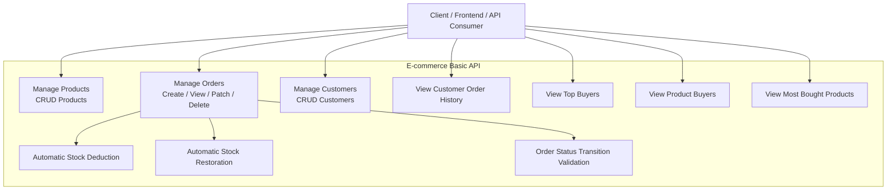
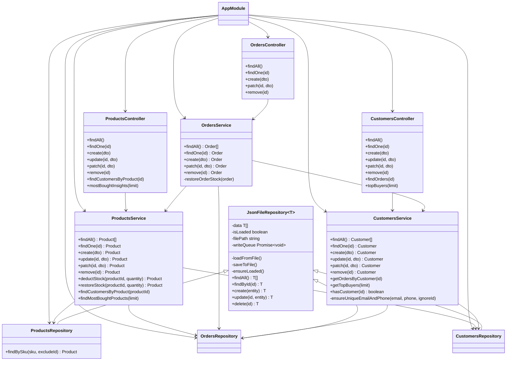
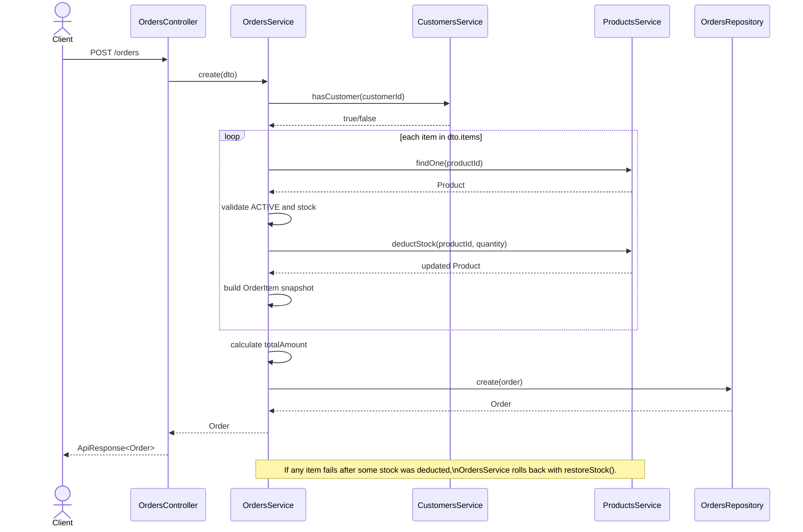
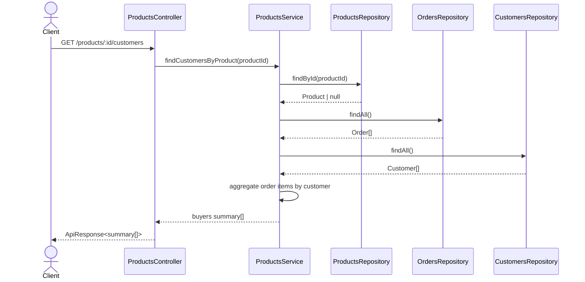
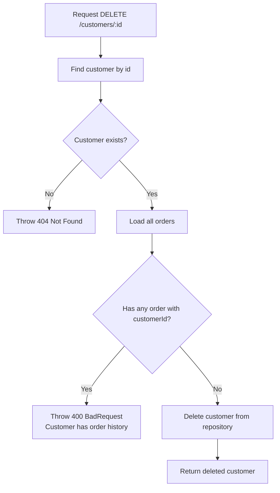
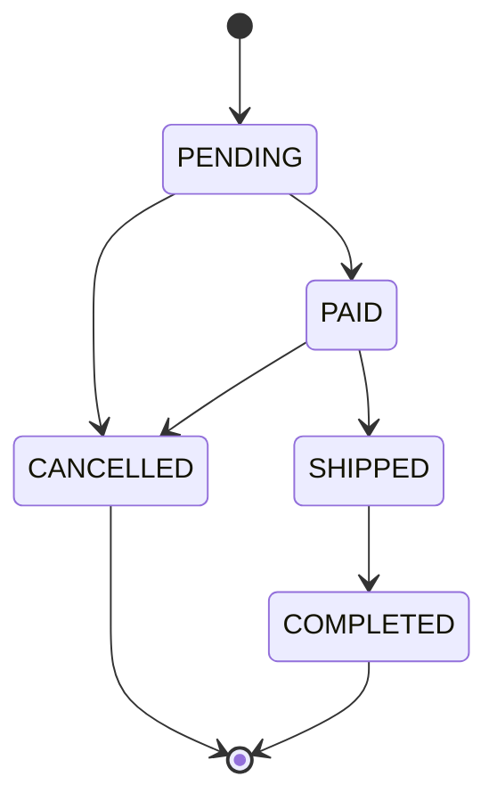
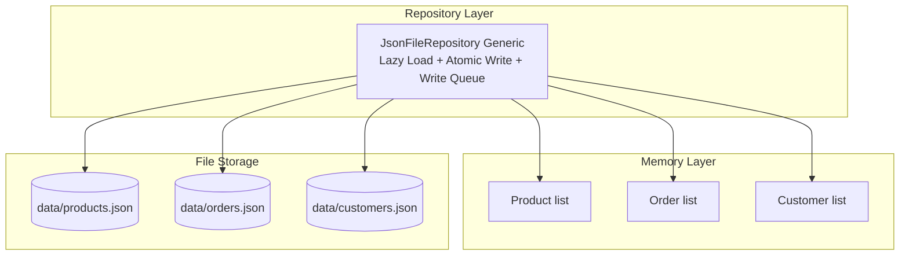

# UML Documentation — E-commerce Basic (Model Set 5)

เอกสารนี้รวบรวม UML ของระบบทั้งหมด โดยอ้างอิงจาก implementation จริงในโค้ด NestJS ปัจจุบัน ไม่ใช่เพียง data model ตามโจทย์เท่านั้น

## Scope

- Backend: NestJS + Swagger + ValidationPipe
- Data source: JSON files (`data/products.json`, `data/orders.json`, `data/customers.json`)
- Domains: Products, Orders, Customers
- Shared components: `AppModule`, `JsonFileRepository<T>`, `BaseEntity`, `ApiResponse<T>`
- Frontend: static dashboard ที่ถูก serve ผ่าน `/app`

---

## 1. System Architecture Diagram

---

## 2. Use Case Diagram

---

## 3. Domain Class Diagram

---

## 4. Entity and DTO Class Diagram

```mermaid
classDiagram
    class BaseEntity {
        +id string
        +createdAt string
        +updatedAt string
    }

    class Product {
        +name string
        +description string
        +price number
        +stockQuantity number
        +sku string
        +category ProductCategory
        +brand string
        +images string[]
        +weight number | null
        +status ProductStatus
    }

    class Customer {
        +fullName string
        +email string
        +phone string
        +address string
        +status CustomerStatus
    }

    class Order {
        +customerId string
        +items OrderItem[]
        +totalAmount number
        +status OrderStatus
        +paymentMethod PaymentMethod
        +shippingAddress string
        +trackingNumber string | null
        +note string | null
        +placedAt string
    }

    class OrderItem {
        +productId string
        +productName string
        +priceAtPurchase number
        +quantity number
        +subtotal number
    }

    class CreateProductDto {
        +name string
        +description string
        +price number
        +stockQuantity number
        +sku string
        +category ProductCategory
        +brand string
        +images string[]
        +weight number
        +status ProductStatus
    }

    class UpdateProductDto {
        +name string
        +description string
        +price number
        +stockQuantity number
        +sku string
        +category ProductCategory
        +brand string
        +images string[]
        +weight number
        +status ProductStatus
    }

    class PatchProductDto {
        +name string
        +description string
        +price number
        +stockQuantity number
        +sku string
        +category ProductCategory
        +brand string
        +images string[]
        +weight number
        +status ProductStatus
    }

    class CreateCustomerDto {
        +fullName string
        +email string
        +phone string
        +address string
        +status CustomerStatus
    }

    class UpdateCustomerDto {
        +fullName string
        +email string
        +phone string
        +address string
        +status CustomerStatus
    }

    class PatchCustomerDto {
        +fullName string
        +email string
        +phone string
        +address string
        +status CustomerStatus
    }

    class CreateOrderDto {
        +customerId string
        +items CreateOrderItemDto[]
        +paymentMethod PaymentMethod
        +shippingAddress string
        +note string
    }

    class CreateOrderItemDto {
        +productId string
        +quantity number
    }

    class PatchOrderDto {
        +status OrderStatus
        +trackingNumber string
        +note string
    }

    class ProductCategory {
        <<enumeration>>
        ELECTRONICS
        CLOTHING
        HOME
        BEAUTY
        OTHER
    }

    class ProductStatus {
        <<enumeration>>
        ACTIVE
        OUT_OF_STOCK
        DISCONTINUED
    }

    class CustomerStatus {
        <<enumeration>>
        ACTIVE
        INACTIVE
    }

    class OrderStatus {
        <<enumeration>>
        PENDING
        PAID
        SHIPPED
        COMPLETED
        CANCELLED
    }

    class PaymentMethod {
        <<enumeration>>
        CREDIT_CARD
        BANK_TRANSFER
        COD
    }

    BaseEntity <|-- Product
    BaseEntity <|-- Customer
    BaseEntity <|-- Order

    Order *-- OrderItem
    Order --> OrderStatus
    Order --> PaymentMethod
    Product --> ProductCategory
    Product --> ProductStatus
    Customer --> CustomerStatus

    CreateProductDto --> ProductCategory
    CreateProductDto --> ProductStatus
    UpdateProductDto --> ProductCategory
    UpdateProductDto --> ProductStatus
    PatchProductDto --> ProductCategory
    PatchProductDto --> ProductStatus
    CreateCustomerDto --> CustomerStatus
    UpdateCustomerDto --> CustomerStatus
    PatchCustomerDto --> CustomerStatus
    CreateOrderDto --> PaymentMethod
    CreateOrderDto *-- CreateOrderItemDto
    PatchOrderDto --> OrderStatus
```

---

## 5. Sequence Diagram — Create Order

---

## 6. Sequence Diagram — Product Buyer Insight

---

## 7. Activity Diagram — Customer Deletion Rule

---

## 8. State Diagram — Order Lifecycle

### Transition Rules

- `PENDING` ไปได้เฉพาะ `PAID` หรือ `CANCELLED`
- `PAID` ไปได้เฉพาะ `SHIPPED` หรือ `CANCELLED`
- `SHIPPED` ไปได้เฉพาะ `COMPLETED`
- `COMPLETED` และ `CANCELLED` เป็น terminal state

---

## 9. Persistence Diagram

---

## 10. Notes for Presentation

- ระบบนี้ไม่ได้มีเพียง 2 core models ตามโจทย์เดิมอีกต่อไป แต่ขยายเป็น 3 domains ที่เชื่อมกันคือ `Product`, `Order`, `Customer`
- `OrdersService` เป็นศูนย์กลางของ business workflow ที่ซับซ้อนที่สุด เพราะต้อง validate ลูกค้า, ตรวจสินค้า, ตัดสต็อก, ทำ rollback และควบคุม state transition
- `ProductsService` มีทั้ง CRUD และ analytics ข้ามโดเมน เช่น most-bought products และ customers by product
- `CustomersService` มีทั้ง CRUD, order history summary และ top buyers
- repository layer ใช้ generic base class เดียวกันทั้งหมดเพื่อแยก business logic ออกจาก file persistence

# [UML](https://app.eraser.io/workspace/qg7vUC9e9wsu1svcCybN?origin=share)