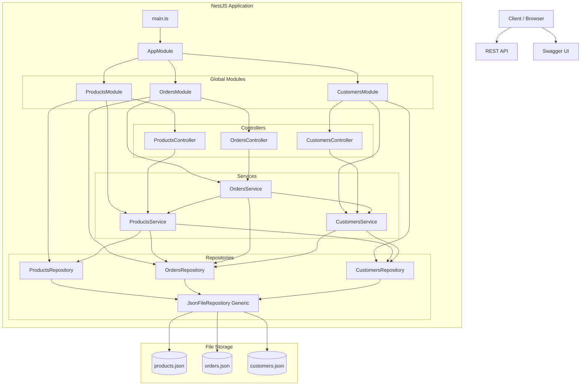
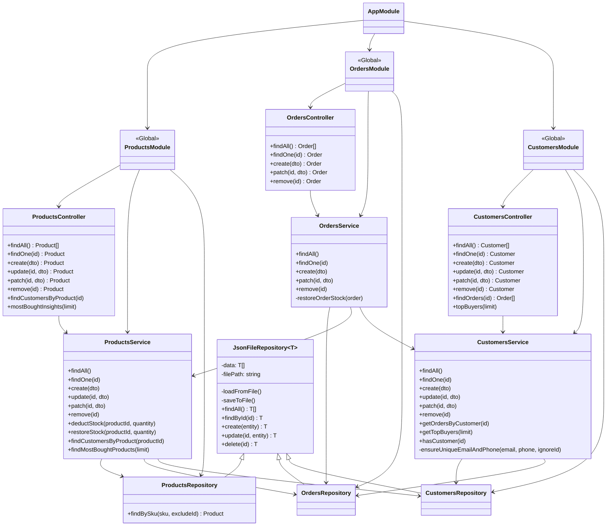
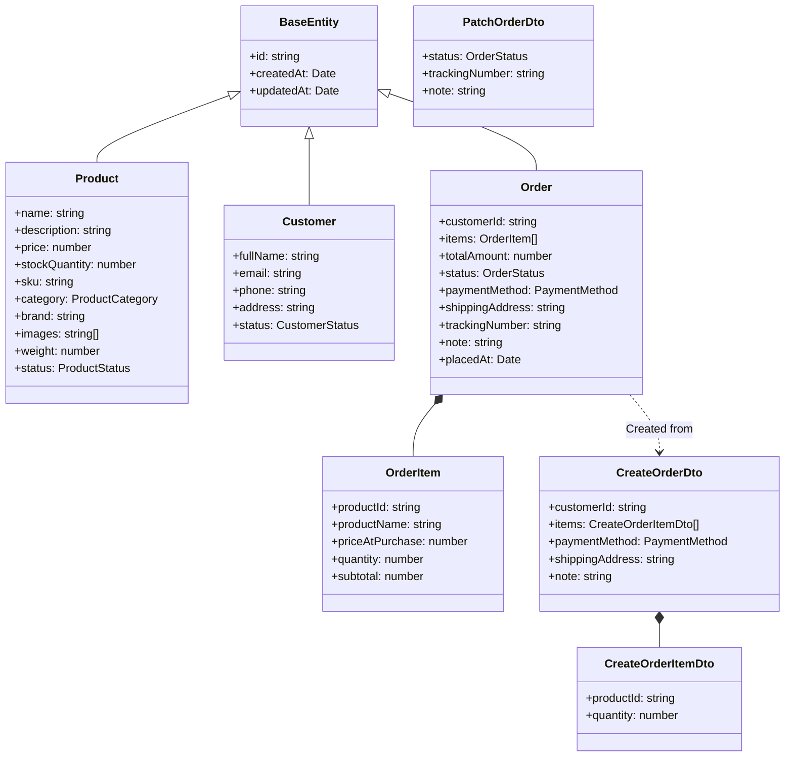
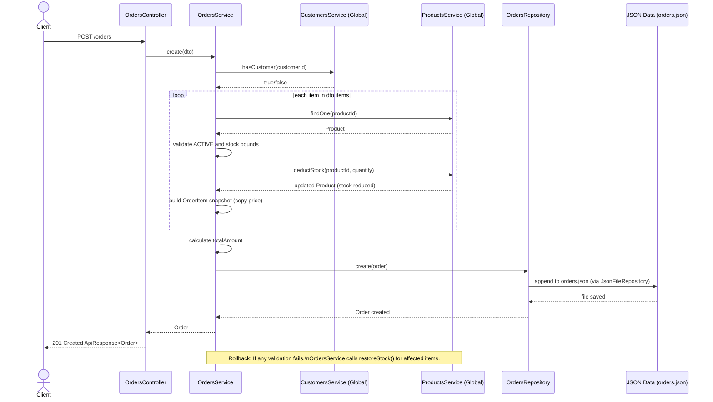
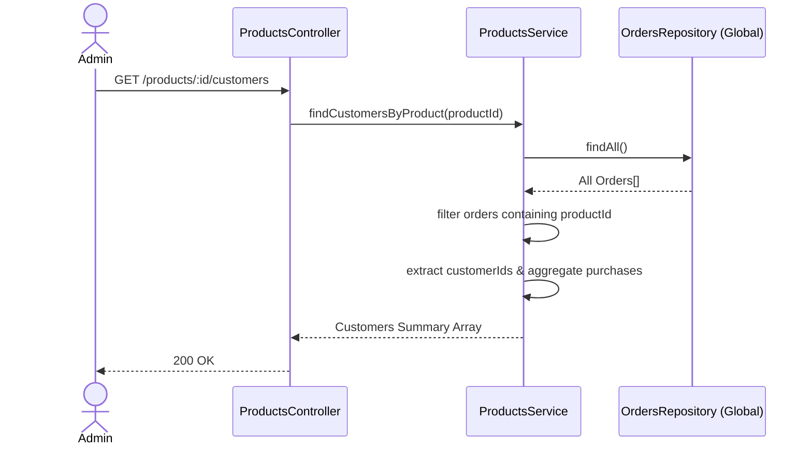
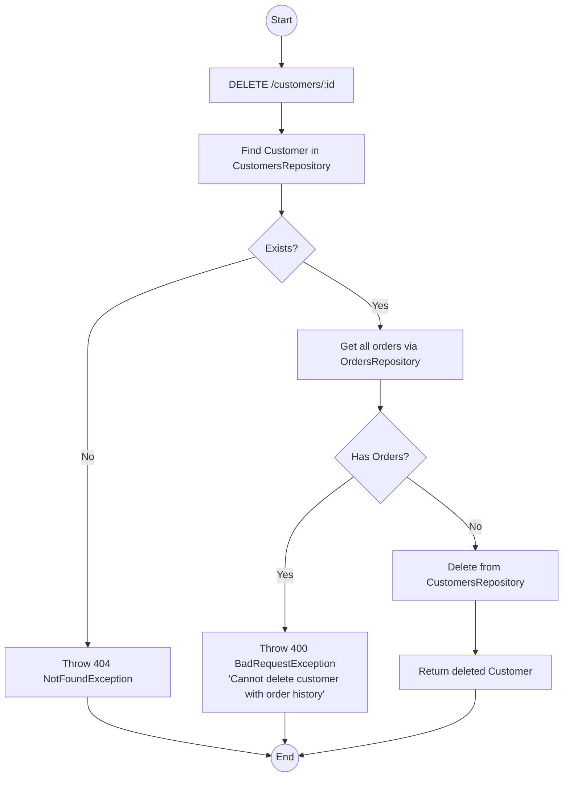
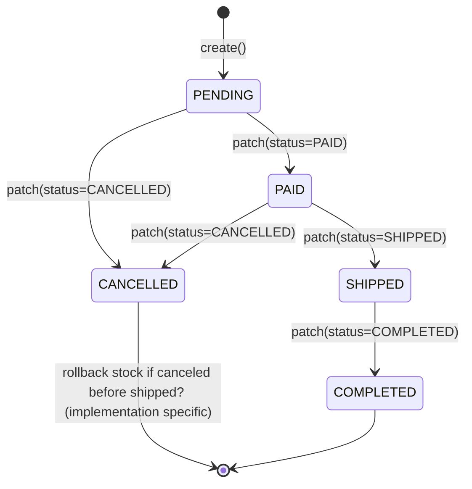

# System UML Diagrams

## 1. System Architecture

## 2. Component Class Diagram

## 3. Entity and DTO Diagram

## 4. Sequence Diagram: Order Creation with Global Modules

## 5. Sequence Diagram: Data Insights (Most Bought / Top Buyers)

## 6. Activity Diagram: Customer Deletion (Foreign Key Check)

## 7. State Diagram: Order Lifecycle

